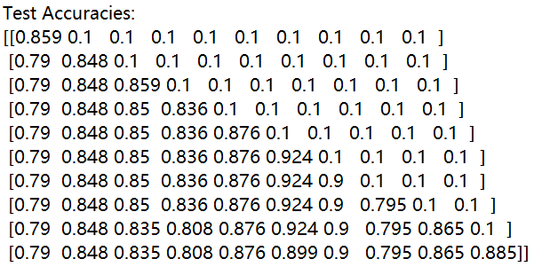

# Task Difficulty Aware Parameter Allocation & Regularization for Lifelong Learning
This is the Source Code of Paper: [Task Difficulty Aware Parameter Allocation & Regularization for Lifelong Learning](https://arxiv.org/abs/2304.05288).

## Enviroment
We provide the conda enviroment file [here](./CondaEnv.yml)

## Run experiment
```bash
source run_files/[run_file_name.sh]
```

### Example: run PAR on CIFAR100-10
执行如下命令：
```bash
sh run_files/cifar100-10/par2.sh
```
实验结果如下：


## Code
in /src
